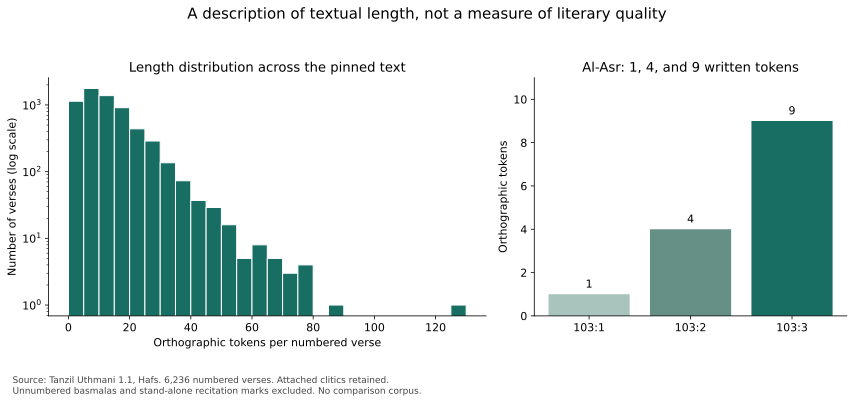

# Descriptive pilot: what is being counted?

Executed against the pinned Tanzil Uthmani 1.1 file. This is a descriptive inventory, not a statistical demonstration of inimitability.

| Quantity | Observed value |
|---|---:|
| Surahs | 114 |
| Numbered verses | 6,236 |
| Orthographic tokens under the stated rule | 77,433 |
| All whitespace fields, including stand-alone signs | 81,812 |
| Median tokens per verse | 10 |
| Mean tokens per verse | 12.42 |
| Interquartile interval | 6–16 |
| Minimum and maximum tokens per verse | 1 and 128 |
| Al-ʿAṣr, verse by verse | 1, 4, 9 |

## Interpretation

The final verse contains nine of the fourteen orthographic tokens in al-ʿAṣr under this rule. That describes space devoted to the exception. It does not by itself demonstrate semantic density or superiority. A token beginning with an attached conjunction remains one written token even though grammatical analysis may separate multiple morphemes.

The difference between all whitespace fields and lexical tokens demonstrates why a counting rule matters. Stand-alone pause or sajdah signs are not lexical words. The raw text is preserved without alteration; the filter is applied only in memory. We export numeric measurements, not a modified Qur’an.

The histogram uses a logarithmic vertical axis to keep rare long verses visible. It does not imply that short or long verses are better. There are no confidence intervals because these are enumerations of a fixed finite file, not estimates from a random sample. Representation and counting uncertainty require sensitivity analysis, not a sampling-error band.

## Reproduction and scope

Run `.venv/bin/python scripts/analyze_corpus.py`. The script checks the SHA-256 digest, sequential surah and verse identifiers, nonempty Arabic text, and the numbered-verse total before calculating results. CSV outputs retain verse IDs and both count definitions.

Only `aya` text attributes are counted. Unnumbered opening basmalas stored in separate attributes are excluded. The numbered basmala at 1:1 and text within 27:30 are retained. The twelve editorial surahs do not constitute a random sample. No human judgments, comparison texts, morphology corpus, acoustic data, or alternative canonical readings have been analyzed in this pilot.

All descriptive verse-length data have now been inspected by this project. They cannot subsequently be portrayed as untouched holdout data for a length hypothesis. A later confirmatory study must disclose this prior exposure.

Source: [Tanzil download](https://tanzil.net/download/), [text types](https://tanzil.net/docs/Quran_Text_Types), [reading provenance](https://tanzil.net/docs/FAQ), [license](https://tanzil.net/docs/Text_License). See `data/manifest.json` for the exact URL, retrieval time, and hash.
